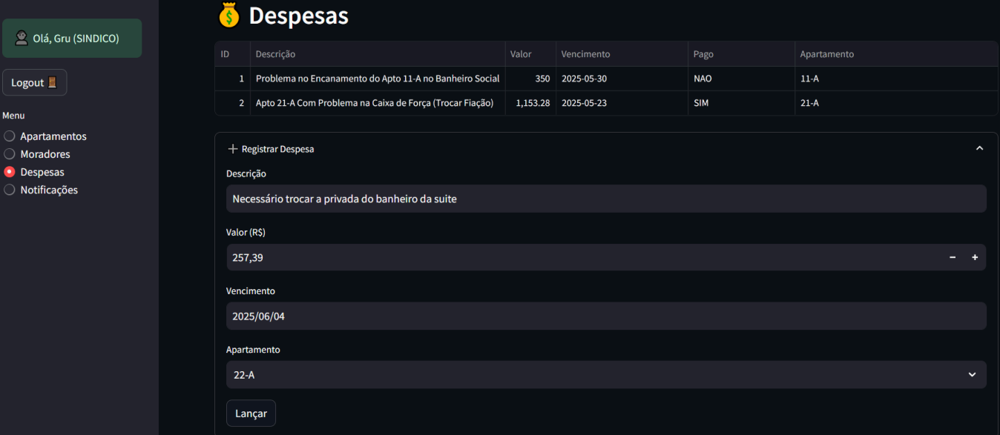

# 🏢 Condominium Manager · Python + Streamlit + MySQL

<p align="center">
  
</p>

**Condominium Manager** is a lightweight web application that centralises key activities for small & medium‑sized residential condominiums:

* apartment and resident registry  
* expense & payment tracking  
* targeted notifications between manager and residents  
* one‑click CSV/PDF financial reports

The project was the final assignment for the **Database Systems** course (PUC‑SP, 2025). 

---

## ✨ Core Features
| Module | Description |
|--------|-------------|
| **Apartments** | Full CRUD for units and their attributes |
| **Residents** | CRUD, role management (*manager* / *resident*) |
| **Expenses & Payments** | Record, list, settle and export data |
| **Notifications** | Send (manager) → inbox (resident) |
| **Reports** | Export expenses to **CSV** or **PDF** |
| **Auth & RBAC** | Login with bcrypt‐hashed passwords & role‑based screens |

All functional and non‑functional requirements defined in the project brief were delivered. 

---

## 🛠 Tech stack

* **Python 3.11**   – business logic  
* **Streamlit**      – responsive web UI  
* **SQLAlchemy ORM** + **MySQL 8** – persistence layer  
* **bcrypt** – secure password hashing  
* **pandas / ReportLab** – CSV & PDF exports

---

## 🏗️ Project layout

```
.
├── app.py                # Streamlit front‑controller
├── security.py           # Auth & session handling (bcrypt)
├── db.py                 # Engine + session maker
├── models.py             # SQLAlchemy ORM models
├── reports.py            # CSV / PDF generation
├── init_db.py            # Bootstrap data & admin user
├── schema.sql            # Full DDL (tables, FK, indexes)
├── requirements.txt
└── README.md
```

---

## ⚙️ Setup

```bash
# 1. clone repo & create venv
python -m venv .venv && source .venv/bin/activate

# 2. install deps
pip install -r requirements.txt

# 3. create database
mysql -u root -p < schema.sql
python init_db.py            # seeds admin / demo data

# 4. run
streamlit run app.py
```

Default credentials (dev): **admin / admin123** – change them after first login!

---

## 🔐 Security highlights
* Passwords stored with **bcrypt + salt**  
* Parameterised ORM queries → prevents SQL Injection  
* FK, UNIQUE & ENUM constraints enforce consistency at DB level  
* Connections auto‑closed via context manager `with get_db():` 

---

## 📈 Database model

The ER diagram consists of five entities (`Apartment`, `Resident`, `Expense`, `Payment`, `Notification`) with proper foreign keys and indexes for performance. See `schema.sql` for the exact DDL. 

---

## 🚀 Roadmap

- Common area booking module  
- Payment gateway integration  
- Mobile app (Flutter)  
- Analytics dashboard (Matplotlib)  
- Online assemblies & voting  

---

## 👨‍💻 Author

**Leonardo Fajardo Grupioni**